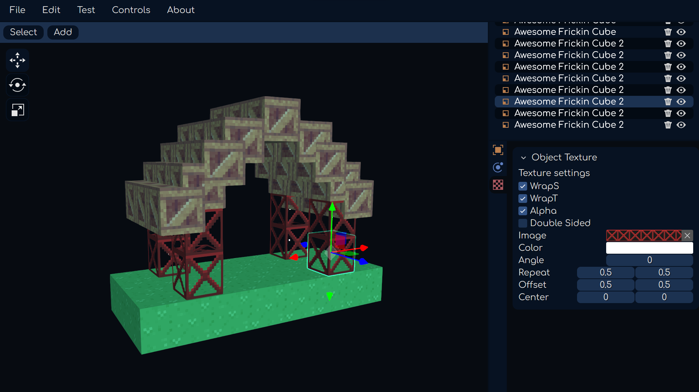

# Level Editor
Designed originally for 3D platform levels. Built with Vue.js (UI) and Three.js (3D engine). Originally developed by Jacob DeBenedetto, this app helps to build levels for games.
Repurposed by OuterBound for Boxel NOMAD

